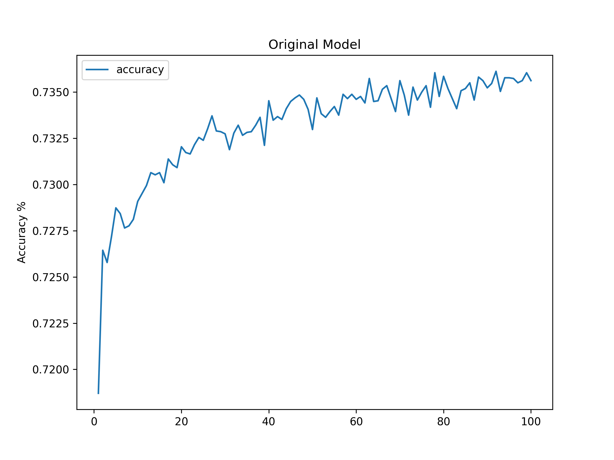
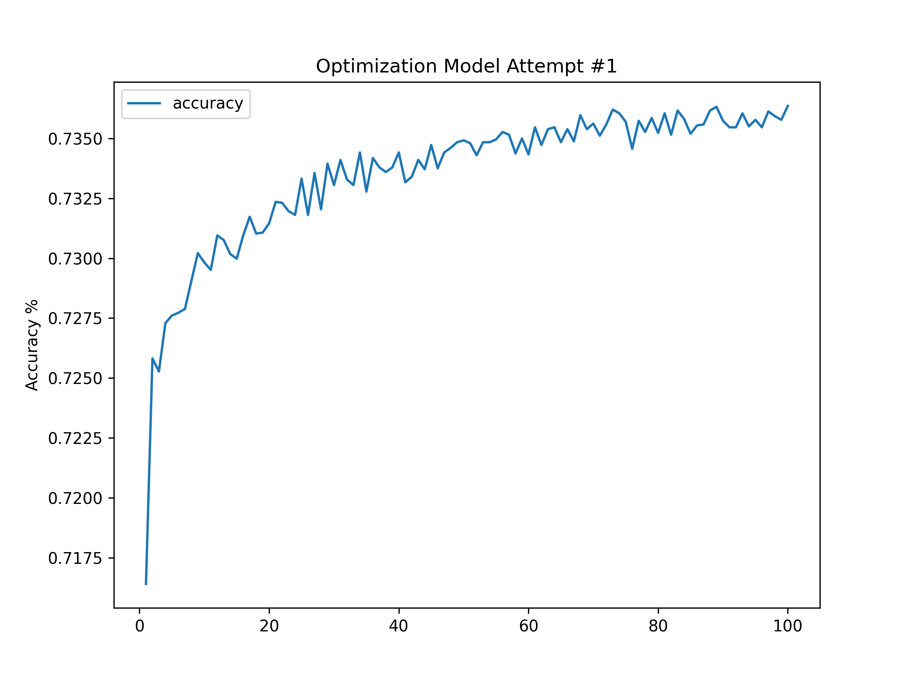
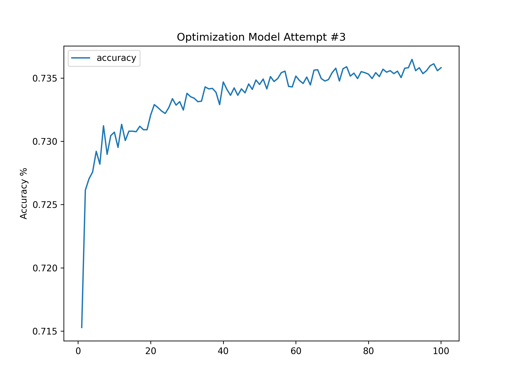

# deep-learning-challenge
Mod 21 Challenge - Deep Learning &amp; Neural Networks
---
## Alphabet Soup Analysis Report
- Overview: The purpose of this analysis is to determine which of Alphabet Soup's funding applicants had the best chance for success with their ventures by using machine learning models and neural networks.

- Data Preprocessing
    - Target Variables - 'IS_SUCCESSFUL', a column in the application_df DataFrame which indicates whether or not the applicant will be successful in their venture (y = numeric_dummies["IS_SUCCESSFUL"].values).
    - Feature Variables - All other columns in the DataFrame (X = numeric_dummies.drop(columns="IS_SUCCESSFUL").values)
    - Excluded Variables - Columns 'EIN', and 'NAME' were dropped as they do not serve a numerical value as either target nor feature variables.

- Compiling, Training, and Evaluating the Model
    - All four models were developed using 2 layers. The amount of neurons in the Original Model were initially chosen at random and adjusted once the resulting paramenters were close to desirable ranges. 
    - Unfortunately, neither model achieved the target 75% Accuracy score. Optimized Model Attempt #2 achieved the closest score, with an accuracy score of 73.36%.

- Results - A total of four models were developed. Results appear below:
    
    - Original Model: 
        - hidden_nodes_layer1 = 85 (relu)
        - hidden_nodes_layer2 = 30 (relu)
        - Loss = 55.85
        - Accuracy % = 73.06%

   
    - Optimized Model Attempt #1:
        - hidden_nodes_layer1 = 90 (relu)
        - hidden_nodes_layer2 = 30 (relu)
        - Loss = 55.71
        - Accuracy % = 73.27%

   
    - (BEST) Optimized Model Attempt #2:
        - hidden_nodes_layer1 = 86 (relu)
        - hidden_nodes_layer2 = 30 (relu)
        - Loss = 56.11
        - Accuracy % = 73.36%

   
    - Optimized Model Attempt #3:
        - hidden_nodes_layer1 = 95 (relu)
        - hidden_nodes_layer2 = 30 (relu)
        - Loss = 55.66
        - Accuracy % = 73.25%

- Summary
    - In summary, four models were developed, each with two layers, but none achieved the desired 75% accuracy score. The best-performing model, Optimized Model Attempt #2, achieved an accuracy of 73.36%, with 86 neurons in the first hidden layer and 30 neurons in the second, using the ReLU activation function. While this analysis provides valuable insights, a different machine learning model, such as a Gradient Boosting ensemble algorithm like XGBoost or LightGBM, could be considered to potentially improve the classification accuracy and optimize the results further. These ensemble methods often perform well on classification problems and could help boost the accuracy of the predictions in this context.

------
# Resources Used
- In-class activities, Tensor Playground, Google, Stack Overflow

# References
- IRS. Tax Exempt Organization Search Bulk Data Downloads. https://www.irs.gov/Links to an external site.